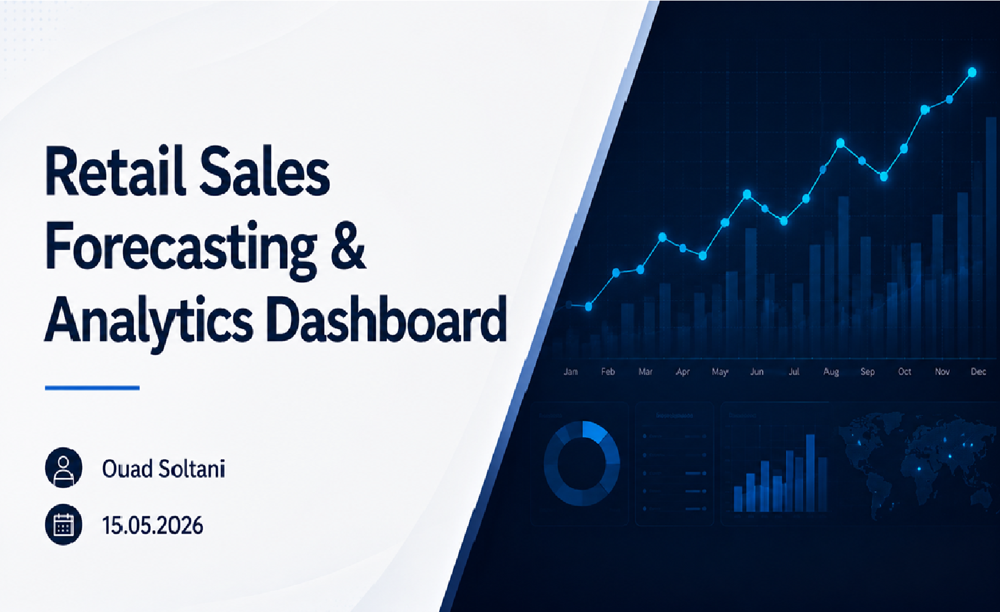
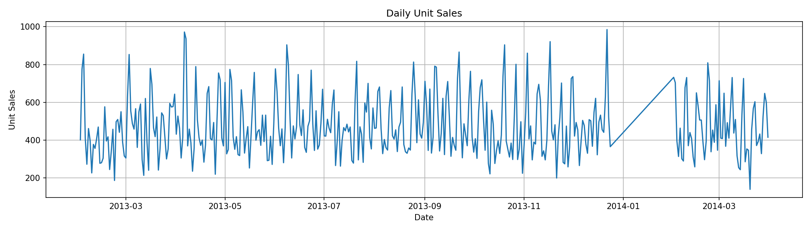
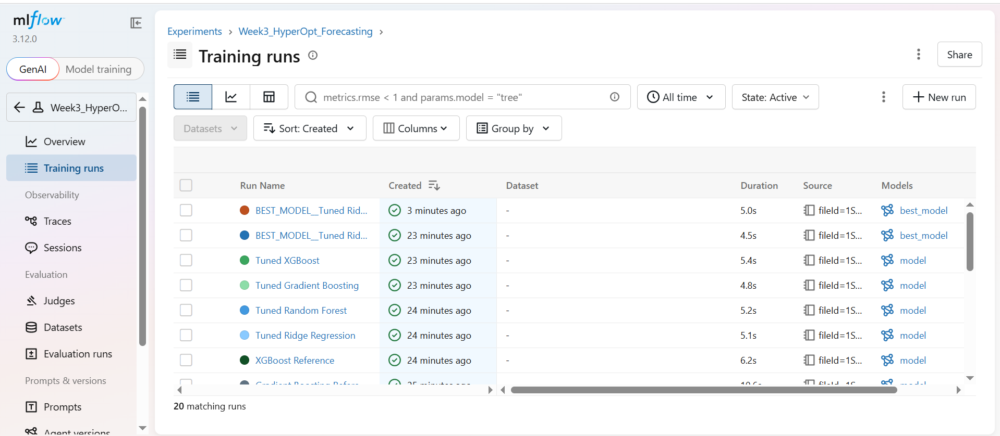
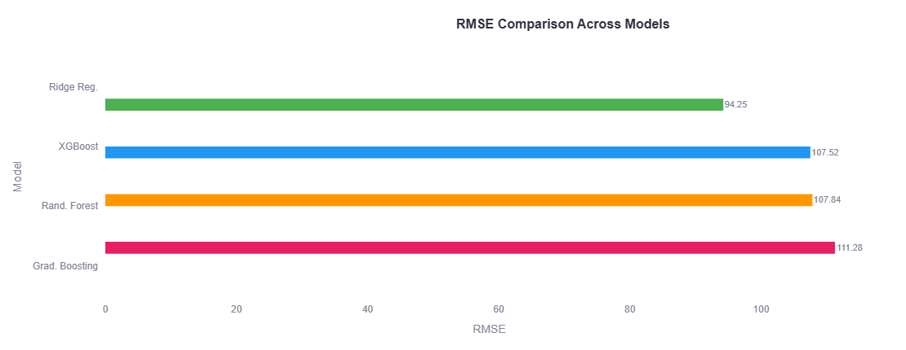
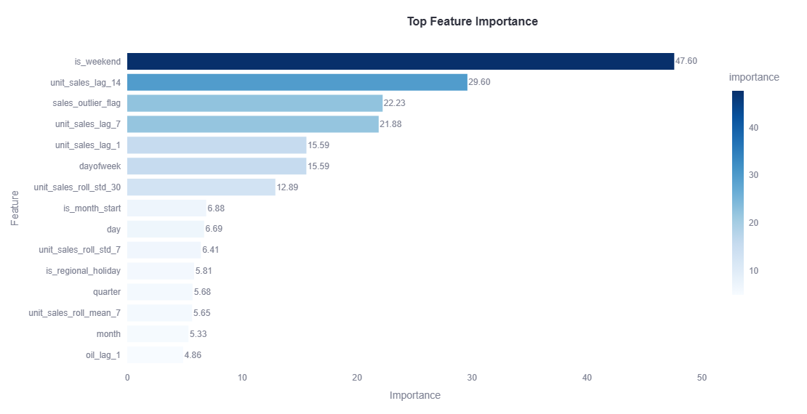
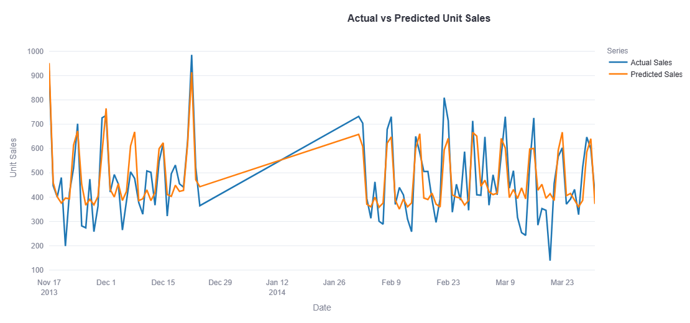

══════════════════════════════════════════════
<div align="center">


</div>



══════════════════════════════════════════════

Retail Sales Forecasting & Analytics Dashboard

Short project description
---

# Header

Display this banner first.


Then create a centered title:

# 📈 Retail Sales Forecasting & Analytics Dashboard

Include a one-paragraph introduction explaining that this project is an end-to-end retail demand forecasting solution combining statistical time series analysis, machine learning, HyperOpt optimization, MLflow experiment tracking, and a Streamlit dashboard.

---

# Badges

Include badges similar to:

Python

Scikit-Learn

XGBoost

MLflow

Streamlit

Time Series

HyperOpt

License MIT

Status Completed

---

# Business Problem

Explain why retail demand forecasting matters.

Mention:

- inventory optimization
- reducing stock shortages
- minimizing overstock
- operational planning
- business decision making

---

# Project Objectives

Create a checklist such as:

✅ Explore historical sales

✅ Engineer time-series features

✅ Compare statistical and machine learning models

✅ Optimize hyperparameters

✅ Track experiments using MLflow

✅ Deploy an interactive dashboard

---

# Dataset

Describe the datasets.

Include a small table.

Dataset | Description
-------- | -----------
Sales | Daily unit sales
Oil | External economic indicator
Holidays | Holiday effects
Stores | Store metadata

Mention the target variable:

unit_sales

---

# Project Workflow

Insert this image.


Then explain each stage.

1. Data Cleaning
2. Exploratory Data Analysis
3. Statistical Forecasting
4. Feature Engineering
5. Machine Learning
6. Hyperparameter Optimization
7. MLflow Tracking
8. Streamlit Dashboard

---

# Repository Structure

Show the repository tree.

---

# Exploratory Data Analysis

Describe:

missing values

stationarity

trend

seasonality

ADF

KPSS

ACF/PACF

Then include the first visualization.



Explain what the figure shows.

---

# Feature Engineering

Explain:

Lag features

Rolling averages

Rolling standard deviations

Calendar variables

Holiday features

Oil prices

Explain why feature engineering is essential for machine learning forecasting.

---

# Models Evaluated

Separate models into two categories.

## Statistical Models

- ARIMA
- Exponential Smoothing
- Prophet (if used)

## Machine Learning Models

- Ridge Regression
- Random Forest
- Gradient Boosting
- XGBoost

Explain why both approaches were compared.

---

# Hyperparameter Optimization

Explain how HyperOpt was used.

Mention Bayesian Optimization.

Explain that HyperOpt searched automatically for the best model parameters.

---

# MLflow Experiment Tracking

Insert this image.



Explain:

- parameter tracking
- metrics
- model comparison
- experiment reproducibility

---

# Best Model

Create a highlighted section.

Mention:

🏆 Tuned Ridge Regression

Include this table.

Metric | Value
------ | -----
MAE | 75.93
RMSE | 94.25
MAPE | 19.69%
R² | 0.651

Explain why Ridge Regression outperformed the other models.

---

# Model Comparison

Insert



Discuss the comparison.

---

# Feature Importance

Insert



Explain which variables contributed most to prediction performance.

---

# Forecast Results

Insert



Explain how closely the model follows the observed sales.

---

# Interactive Dashboard

Explain that a Streamlit dashboard was developed.

Include:

Dashboard features:

- forecast visualization
- model metrics
- feature importance
- downloadable predictions
- business insights

Mention that a demonstration video is included in:

assets/Dashboard video.webm

---

# Installation

Provide commands.

```bash
git clone https://github.com/Ouad90/retail-sales-forecasting.git

cd retail-sales-forecasting

pip install -r requirements.txt

streamlit run streamlit_app.py
```

---

# Technologies Used

Create badges or icons for:

Python

Pandas

NumPy

Matplotlib

Scikit-Learn

Statsmodels

XGBoost

HyperOpt

MLflow

Streamlit

Plotly

---

# Key Business Insights

Summarize findings.

For example:

Weekend demand is consistently higher.

Lag variables strongly improve forecasting.

Historical demand is highly predictive.

Calendar effects significantly influence retail sales.

Forecasting supports inventory optimization.

---

# Limitations

Discuss:

single dataset

historical data only

no weather/promotions

prototype dashboard

---

# Future Improvements

Mention:

LightGBM

CatBoost

LSTM

Transformer models

Walk-forward validation

Prediction intervals

Cloud deployment

CI/CD

Docker

---

# Dashboard Preview

Include a note that a PDF dashboard overview and demonstration video are available in the assets folder.

---

# Conclusion

Write a professional conclusion summarizing the complete end-to-end forecasting pipeline and emphasizing practical business value.

---

The final README should resemble a polished GitHub portfolio project suitable for recruiters and hiring managers.
