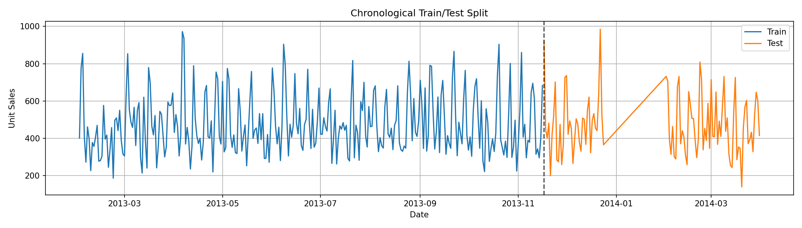

<div align="center">


</div>


<div align="center">

# 📈 Retail Sales Forecasting & Analytics Dashboard

### End-to-End Time Series Forecasting • Machine Learning • MLflow • Streamlit

An end-to-end **retail demand forecasting solution** combining statistical time-series analysis, feature engineering, machine learning, Bayesian hyperparameter optimization with HyperOpt, MLflow experiment tracking, and an interactive Streamlit dashboard.

</div>

---

## 📑 Table of Contents

* [Business Problem](#-business-problem)
* [Project Objectives](#-project-objectives)
* [Dataset](#-dataset)
* [Project Workflow](#-project-workflow)
* [Repository Structure](#-repository-structure)
* [Exploratory Data Analysis](#-exploratory-data-analysis)
* [Feature Engineering](#-feature-engineering)
* [Models Evaluated](#-models-evaluated)
* [Hyperparameter Optimization](#-hyperparameter-optimization)
* [MLflow Experiment Tracking](#-mlflow-experiment-tracking)
* [Best Model](#-best-model)
* [Model Comparison](#-model-comparison)
* [Feature Importance](#-feature-importance)
* [Forecast Results](#-forecast-results)
* [Interactive Dashboard](#-interactive-dashboard)
* [Installation](#-installation)
* [Technologies Used](#-technologies-used)
* [Key Business Insights](#-key-business-insights)
* [Limitations](#-limitations)
* [Future Improvements](#-future-improvements)
* [Dashboard Preview](#-dashboard-preview)
* [Conclusion](#-conclusion)

---

## 💼 Business Problem

Retail businesses need to anticipate future demand before making inventory and operational decisions.

Inaccurate forecasts can lead to:

* 📦 **Overstocking**, increasing storage costs and tying up capital
* ⚠️ **Stock shortages**, resulting in missed sales opportunities
* 🗑️ **Product waste**, particularly for time-sensitive inventory
* 👥 **Inefficient staffing and operational planning**
* 📉 **Poor allocation of inventory and resources**

The goal of this project is therefore to develop a forecasting workflow capable of learning from historical retail demand and supporting better **inventory optimization, demand planning, and business decision-making**.

---

## 🎯 Project Objectives

* [x] Explore and understand historical retail sales
* [x] Clean and integrate multiple datasets
* [x] Analyze trends, seasonality, stationarity, and autocorrelation
* [x] Engineer time-series features for machine learning
* [x] Evaluate statistical and machine-learning forecasting approaches
* [x] Compare multiple machine-learning algorithms
* [x] Optimize model hyperparameters using HyperOpt
* [x] Track model experiments using MLflow
* [x] Identify and save the best-performing model
* [x] Build an interactive Streamlit forecasting dashboard

---

## 📊 Dataset

The project combines historical retail sales with calendar, store, holiday, and external economic information.

| Dataset      | Description                    | Role                        |
| ------------ | ------------------------------ | --------------------------- |
| **Sales**    | Historical daily unit sales    | Main forecasting series     |
| **Oil**      | Oil-price information          | External economic indicator |
| **Holidays** | Holiday dates and descriptions | Calendar/demand effects     |
| **Stores**   | Store metadata                 | Retail context              |

### 🎯 Target Variable

```text
unit_sales
```

This is the variable the forecasting models attempt to predict.

The repository separates source and transformed datasets:

```text
data/
├── raw/
└── processed/
```

This keeps the modeling workflow organized and reproducible.

---

## 🔄 Project Workflow


The project follows an end-to-end forecasting workflow:

```text
Raw Retail Data
       │
       ▼
Data Cleaning & Integration
       │
       ▼
Exploratory Data Analysis
       │
       ▼
Statistical Time-Series Analysis
       │
       ▼
Feature Engineering
       │
       ▼
Machine-Learning Models
       │
       ▼
HyperOpt Optimization
       │
       ▼
MLflow Experiment Tracking
       │
       ▼
Best Model Selection
       │
       ▼
Streamlit Dashboard
```

### 1️⃣ Data Cleaning

The source datasets are loaded, checked, merged, and prepared for analysis.

### 2️⃣ Exploratory Data Analysis

Historical demand is examined to understand its temporal behavior and identify important patterns.

### 3️⃣ Statistical Forecasting

Classical time-series methods provide a statistical perspective on the forecasting problem.

### 4️⃣ Feature Engineering

The sequential time series is transformed into a supervised machine-learning dataset.

### 5️⃣ Machine Learning

Multiple regression and ensemble models are trained and evaluated.

### 6️⃣ Hyperparameter Optimization

HyperOpt searches for improved configurations for the machine-learning models.

### 7️⃣ MLflow Tracking

Experiments, parameters, and performance metrics are systematically recorded.

### 8️⃣ Streamlit Dashboard

The final results are transformed into an interactive application for easier interpretation.

---

## 📁 Repository Structure

```text
retail-sales-forecasting/
│
├── assets/
│   ├── project_banner.png
│   ├── workflow.png
│   ├── mlflow_runs.png
│   ├── model_comparison.png
│   ├── feature_importance.png
│   ├── forecast_plot.png
│   ├── Dashboard Overview.pdf
│   └── Dashboard video.webm
│
├── data/
│   ├── raw/
│   └── processed/
│
├── models/
│   └── best_model.joblib
│
├── notebooks/
│   ├── 01_data_cleaning_eda.ipynb
│   ├── 02_statistical_forecasting.ipynb
│   └── 03_machine_learning_forecasting.ipynb
│
├── outputs/
│   ├── best_model_metrics.json
│   ├── best_model_name.txt
│   ├── best_model_predictions.csv
│   ├── feature_importance.csv
│   ├── reference_model_results.csv
│   └── tuned_model_comparison.csv
│
├── plots/
│   ├── 01_daily_unit_sales.png
│   ├── 02_train_test_split.png
│   ├── tuned_model_comparison_mae.png
│   ├── tuned_model_comparison_rmse.png
│   ├── tuned_ridge_regression_forecast.png
│   ├── tuned_ridge_regression_residuals.png
│   └── ...
│
├── presentation/
│
├── streamlit_app.py
├── requirements.txt
├── LICENSE
└── README.md
```

| Directory         | Purpose                                                         |
| ----------------- | --------------------------------------------------------------- |
| `assets/`         | Selected visuals used in the README and dashboard documentation |
| `data/raw/`       | Original source datasets                                        |
| `data/processed/` | Cleaned and model-ready datasets                                |
| `models/`         | Serialized best-performing model                                |
| `notebooks/`      | Complete analytical workflow                                    |
| `outputs/`        | Predictions, metrics, feature results, and model comparisons    |
| `plots/`          | EDA, tuning, forecasting, and diagnostic visualizations         |
| `presentation/`   | Project presentation materials                                  |

---

## 🔍 Exploratory Data Analysis

Before training forecasting models, the historical sales series was investigated to understand its underlying structure.

The EDA stage included:

* 🔎 Missing-value analysis
* 📈 Trend exploration
* 🔁 Seasonality analysis
* 📊 Sales-distribution analysis
* 🧪 Stationarity testing
* 📉 Augmented Dickey-Fuller (**ADF**) test
* 📉 KPSS test
* 🔗 Autocorrelation Function (**ACF**)
* 🔗 Partial Autocorrelation Function (**PACF**)
* ⏱️ Time-aware train/test splitting

### Daily Unit Sales


The historical series shows substantial variation in daily sales, including periods of relatively stable demand and pronounced sales peaks.

These temporal patterns indicate that previous sales behavior can provide useful information for forecasting future demand.

### Time-Aware Train/Test Split



Unlike conventional machine-learning problems, time-series observations should not be randomly shuffled before forecasting.

The data was therefore divided chronologically so that earlier observations were used for training and later observations were reserved for evaluation.

This more closely represents a real forecasting scenario:

> **Learn from the past → predict the future.**

---

## 🛠️ Feature Engineering

Machine-learning algorithms do not automatically understand that observations belong to a chronological sequence.

Feature engineering was therefore used to convert the original time series into a structured supervised-learning dataset.

### ⏳ Lag Features

Lag variables provide models with information about previous sales observations.

They help answer questions such as:

> How informative are previous sales values for predicting future demand?

---

### 📊 Rolling Statistics

Rolling windows summarize recent sales behavior.

Engineered variables include statistics such as:

* Rolling averages
* Rolling standard deviations
* Recent demand patterns

These features help models distinguish short-term fluctuations from broader sales behavior.

---

### 📅 Calendar Features

Calendar information helps capture recurring temporal effects.

Examples include:

* Day of week
* Month
* Weekend indicators
* Holiday information

---

### 🌍 External Variables

Oil-price information provides an additional external economic variable that can be evaluated alongside historical demand.

---

### Why Feature Engineering Matters

Feature engineering transforms temporal information into variables that standard machine-learning models can interpret.

Instead of seeing only:

```text
Today's sales
```

the model can receive contextual information such as:

```text
Previous sales
+ recent average sales
+ recent variability
+ calendar information
+ holiday information
+ external variables
```

This enables conventional machine-learning algorithms to learn meaningful temporal relationships.

---

## 🤖 Models Evaluated

The project explores forecasting from both **statistical** and **machine-learning** perspectives.

### 📈 Statistical Models

The statistical forecasting stage investigates classical approaches to modeling temporal structure, including:

* **ARIMA**
* **Exponential Smoothing**

These methods provide a useful statistical reference for understanding trends, autocorrelation, and time-dependent behavior.

---

### 🧠 Machine-Learning Models

Four machine-learning algorithms were evaluated:

| Model                 | Type                        | Main Characteristic                                             |
| --------------------- | --------------------------- | --------------------------------------------------------------- |
| **Ridge Regression**  | Regularized linear model    | Controls coefficient magnitude to reduce overfitting            |
| **Random Forest**     | Tree ensemble               | Combines predictions from multiple decision trees               |
| **Gradient Boosting** | Boosting ensemble           | Sequentially improves predictions by correcting previous errors |
| **XGBoost**           | Optimized gradient boosting | Powerful tree-based algorithm for structured data               |

Testing models with different levels of complexity makes it possible to determine whether nonlinear ensemble methods actually improve forecasting performance over a simpler regularized model.

---

## ⚙️ Hyperparameter Optimization

Machine-learning performance depends not only on the algorithm but also on its **hyperparameters**.

Instead of selecting these settings manually, the project uses **HyperOpt** for automated optimization.

### 🔎 Optimization Process

```text
Define Search Space
        ↓
Define Evaluation Objective
        ↓
Run HyperOpt Trials
        ↓
Evaluate Candidate Parameters
        ↓
Use Previous Trials to Guide Search
        ↓
Return Best Configuration
```

HyperOpt applies a Bayesian optimization approach that uses information from previous evaluations to focus future trials on promising areas of the search space.

This provides a more systematic approach than manually testing arbitrary parameter combinations.

---

## 🧪 MLflow Experiment Tracking


Multiple models and tuning experiments can quickly become difficult to manage.

**MLflow** was therefore used to systematically track the modeling process.

MLflow supports:

* ⚙️ **Parameter tracking**
* 📊 **Performance metric logging**
* 🧪 **Experiment organization**
* 🔄 **Model comparison**
* 📚 **Experiment history**
* ♻️ **Reproducibility**

Each experiment can be reviewed independently, making it easier to understand how parameter changes affected forecasting performance.

---

## 🏆 Best Model

<div align="center">

### 🥇 Tuned Ridge Regression

**Best-performing machine-learning model**

</div>

| Metric   |      Value |
| -------- | ---------: |
| **MAE**  |  **75.93** |
| **RMSE** |  **94.25** |
| **MAPE** | **19.69%** |
| **R²**   |  **0.651** |

### 📊 Interpretation

**MAE — 75.93**

Predictions differed from the observed sales values by approximately **76 units on average**.

**RMSE — 94.25**

RMSE penalizes larger forecasting errors more strongly than MAE, providing additional information about larger prediction deviations.

**MAPE — 19.69%**

The average absolute percentage difference between forecasts and observations was approximately **19.7%**.

**R² — 0.651**

The model explained approximately **65.1% of the variation in the target variable** on the evaluated data.

### 💡 Why is this result interesting?

The more complex tree-based algorithms did not automatically produce the strongest final result.

The engineered features already captured substantial temporal information, allowing a regularized linear model to achieve strong forecasting performance.

This demonstrates an important machine-learning principle:

> **The best model is not necessarily the most complex model.**

---

## 📊 Model Comparison


The tuned machine-learning models were compared using common regression and forecasting metrics.

The comparison makes it possible to evaluate model performance objectively rather than selecting an algorithm based only on complexity or popularity.

The final results identified **Tuned Ridge Regression** as the strongest-performing model among the evaluated machine-learning approaches.

---

## 🔎 Feature Importance


Understanding which variables contribute to predictions is an important part of building interpretable forecasting systems.

The engineered feature set contains information derived from:

* ⏳ Historical sales
* 🔁 Lag variables
* 📊 Rolling statistics
* 📅 Calendar information
* 🎉 Holiday effects
* 🌍 External variables

The analysis indicates that historical sales information provides important predictive signals for future retail demand.

---

## 📈 Forecast Results


The forecast visualization compares the model's predictions with the actual observed sales during the evaluation period.

The model captures much of the overall demand behavior, while some larger short-term fluctuations and sales peaks remain more difficult to predict.

These remaining errors highlight opportunities for future improvements through additional external variables and more advanced forecasting approaches.

---

## 💻 Interactive Dashboard

A **Streamlit dashboard** was developed to transform the analytical results into an interactive forecasting interface.

Rather than requiring users to navigate notebooks and raw output files, the dashboard provides a centralized view of the main project results.

### ✨ Dashboard Features

* 🏆 Best-model summary
* 📊 Forecasting performance metrics
* 📉 Model-performance comparison
* 📈 Actual vs. predicted sales visualization
* 🔎 Feature analysis
* 📥 Downloadable prediction results
* 💡 Business insights

---

## 🖥️ Dashboard Preview

Additional dashboard materials are available inside the `assets/` directory.

### 📄 Dashboard Overview

```text
assets/Dashboard Overview.pdf
```

### 🎥 Dashboard Demonstration

```text
assets/Dashboard video.webm
```

The application itself can be launched locally using:

```bash
streamlit run streamlit_app.py
```

---

## ⚙️ Installation

### 1️⃣ Clone the repository

```bash
git clone https://github.com/Ouad90/retail-sales-forecasting.git
```

### 2️⃣ Enter the project directory

```bash
cd retail-sales-forecasting
```

### 3️⃣ Install dependencies

```bash
pip install -r requirements.txt
```

### 4️⃣ Launch the Streamlit dashboard

```bash
streamlit run streamlit_app.py
```

The application should then open in your web browser.

---

## 🧰 Technologies Used

<div align="center">


</div>

### Technology Stack

| Area                     | Technologies          |
| ------------------------ | --------------------- |
| **Programming**          | Python                |
| **Data Processing**      | Pandas, NumPy         |
| **Visualization**        | Matplotlib, Plotly    |
| **Statistical Analysis** | Statsmodels           |
| **Machine Learning**     | Scikit-Learn, XGBoost |
| **Optimization**         | HyperOpt              |
| **Experiment Tracking**  | MLflow                |
| **Dashboard**            | Streamlit             |
| **Version Control**      | Git, GitHub           |

---

## 💡 Key Business Insights

The project highlights several findings relevant to retail demand planning.

### 📅 Calendar Effects Matter

Sales behavior varies across the calendar, making time-related information useful for demand forecasting.

### 🛒 Weekend Demand Differs from Weekday Demand

Weekend sales patterns provide useful contextual information that can support inventory and operational planning.

### ⏳ Historical Demand is Predictive

Previous sales values contain important information about future demand, supporting the use of lag-based features.

### 📊 Rolling Statistics Provide Useful Context

Rolling averages and variability measures summarize recent sales behavior and provide additional signals to machine-learning models.

### 🤖 More Complexity Does Not Guarantee Better Results

The tuned Ridge Regression model outperformed the more complex alternatives evaluated in the project.

### 📦 Forecasting Can Support Retail Planning

Demand forecasts can provide useful decision support for:

* Inventory planning
* Stock replenishment
* Resource allocation
* Operational preparation

---

## ⚠️ Limitations

The project should be interpreted within several limitations:

* 📚 The analysis is based on a historical dataset.
* 🌍 The available external variables are limited.
* 🌦️ Weather information was not incorporated.
* 🏷️ Detailed promotional and pricing information was not available.
* 📈 Unusual demand spikes remain difficult to predict.
* 💻 The Streamlit application is a portfolio prototype rather than a production forecasting platform.
* 🔄 Additional time-series validation could provide a more robust assessment of generalization performance.

---

## 🚀 Future Improvements

Several extensions could strengthen the forecasting system.

### 🤖 Additional Machine-Learning Models

* LightGBM
* CatBoost

### 🧠 Deep Learning

* LSTM
* Recurrent neural networks
* Transformer-based forecasting models

### 📊 Forecasting Methodology

* Walk-forward validation
* Time-series cross-validation
* Prediction intervals
* Forecast uncertainty estimation

### 🌍 Additional Data

* Weather information
* Promotional campaigns
* Product pricing
* Local events
* Additional economic indicators

### 🏪 Forecasting Granularity

Extend the project toward:

* Store-level forecasting
* Product-level forecasting
* Category-level forecasting

### ☁️ Deployment & MLOps

* Cloud deployment
* Docker containerization
* GitHub Actions
* CI/CD
* Automated model retraining
* Performance monitoring

---

## 🎓 What This Project Demonstrates

This repository demonstrates more than model training.

It covers the complete path from raw data to an interactive forecasting application:

```text
Data
 ↓
Analysis
 ↓
Feature Engineering
 ↓
Modeling
 ↓
Optimization
 ↓
Experiment Tracking
 ↓
Evaluation
 ↓
Deployment
 ↓
Business Interpretation
```

### Skills Demonstrated

* 📈 Time-series analysis
* 🔍 Exploratory data analysis
* 🛠️ Feature engineering
* 📊 Statistical forecasting
* 🤖 Machine learning
* ⚙️ Hyperparameter optimization
* 🧪 Experiment tracking
* 📉 Model evaluation
* 🔎 Model interpretation
* 💻 Streamlit application development
* 💼 Business-oriented data communication

---

## 🏁 Conclusion

This project demonstrates an end-to-end approach to **retail sales forecasting**, beginning with raw-data preparation and time-series exploration and progressing through feature engineering, statistical analysis, machine-learning optimization, experiment tracking, model selection, and interactive dashboard development.

The final **Tuned Ridge Regression** model achieved an **MAE of 75.93**, **RMSE of 94.25**, **MAPE of 19.69%**, and **R² of 0.651** on the evaluated data.

The results show that carefully engineered historical and calendar features can provide meaningful predictive information without requiring an unnecessarily complex model.

By combining forecasting methodology with **HyperOpt**, **MLflow**, and **Streamlit**, the project demonstrates how a data-science workflow can move beyond experimentation toward an accessible decision-support solution for retail demand planning.

---

<div align="center">

### ⭐ If you found this project useful, consider giving the repository a star!

**Built with Python • Time Series Forecasting • Machine Learning • MLflow • Streamlit**

</div>
